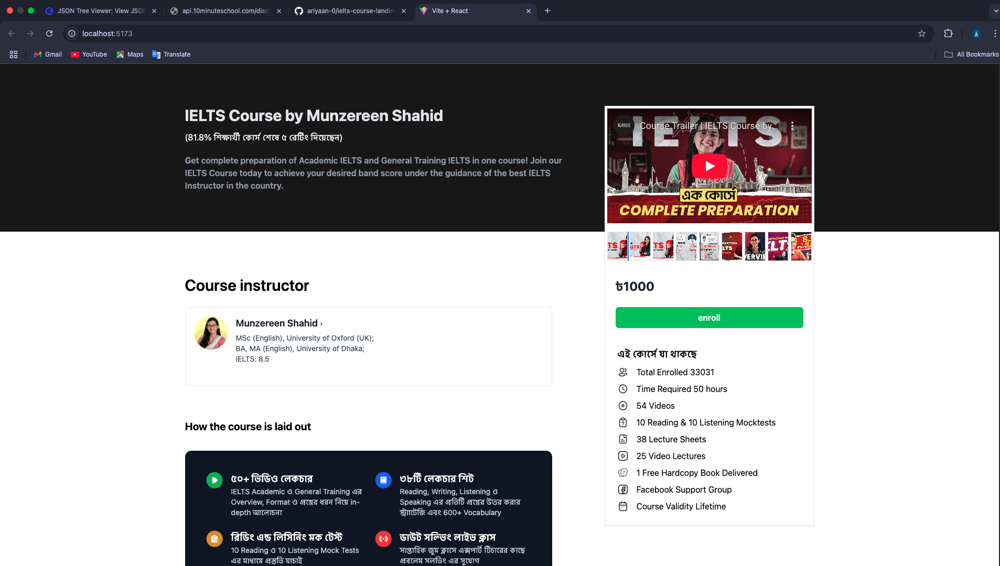

# IELTS Course Landing Page

A modern landing page for IELTS courses built with [React](https://react.dev/) and [Vite](https://vitejs.dev/).

## Features

-   ⚡️ Fast development with Vite
-   🛡️ TypeScript for type safety
-   🎨 Tailwind CSS for styling
-   📦 Modular React components



## Getting Started

### Installation

```bash
npm install
```

### Development

```bash
npm run dev
```

Open [http://localhost:5173](http://localhost:5173) to view the app.

### Build

```bash
npm run build
```

## Project Structure

```
ielts-course-landing/
├── src/
│   ├── components/
│   ├── pages/
│   ├── App.tsx
│   └── main.tsx
├── public/
├── index.html
├── package.json
├── tsconfig.json
├── vite.config.ts
└── README.md
```
